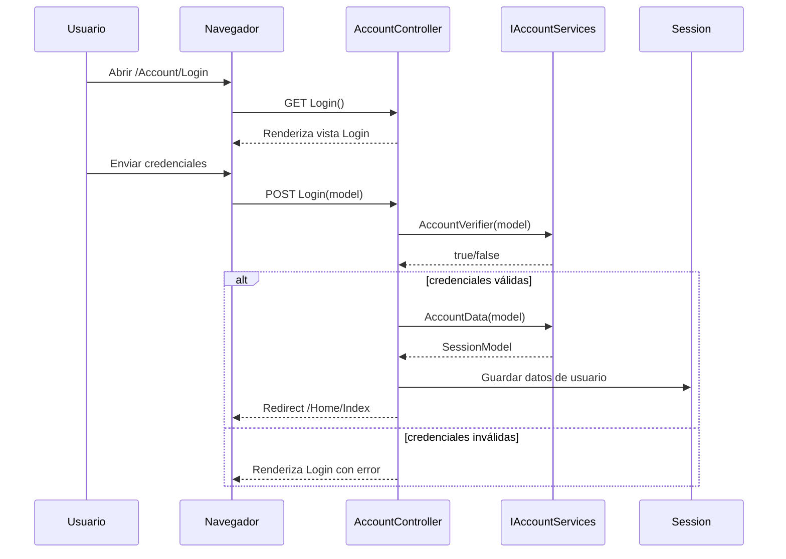
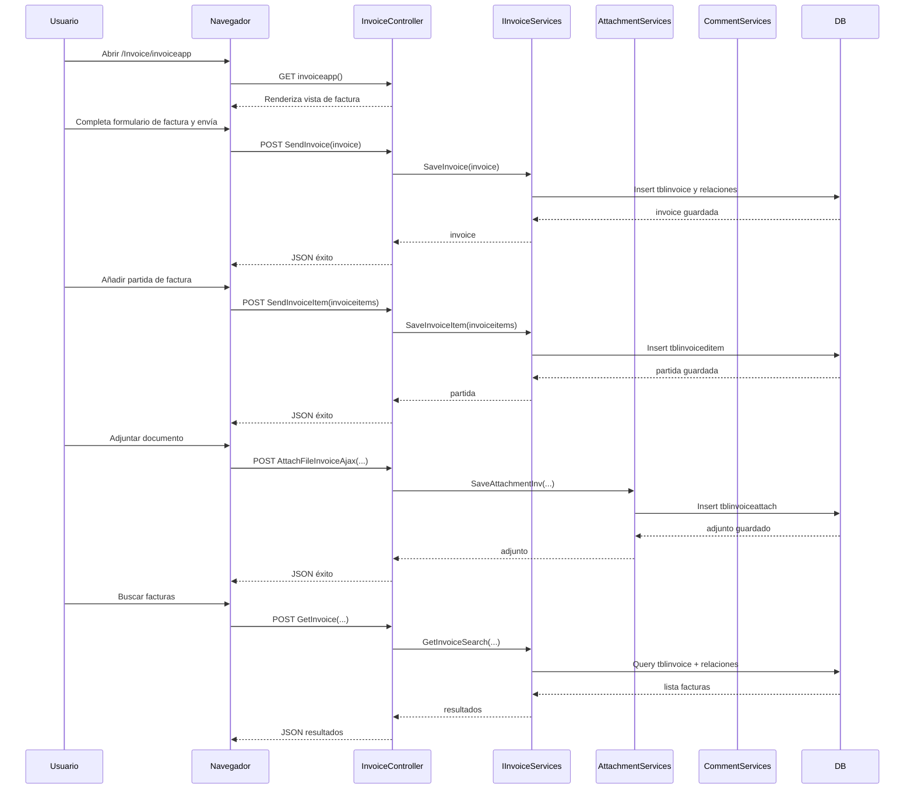
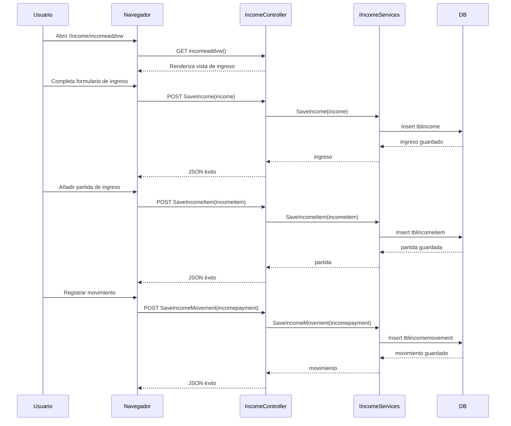
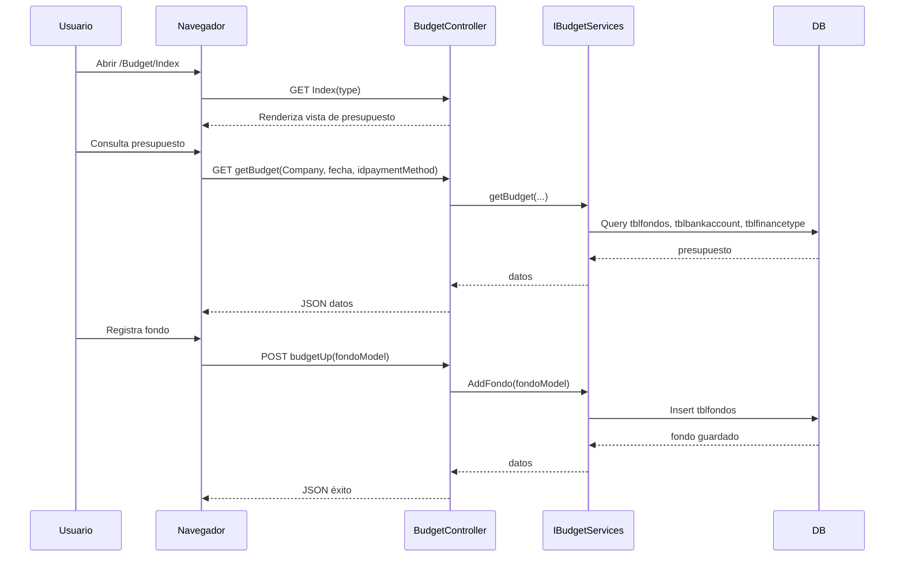
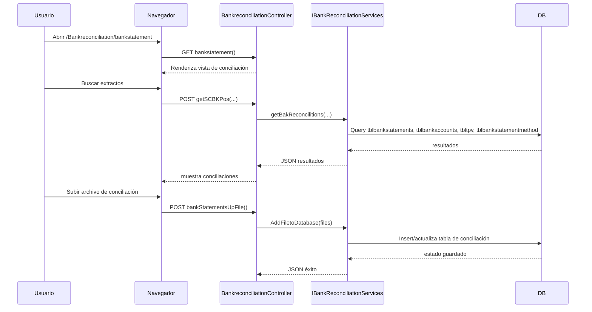
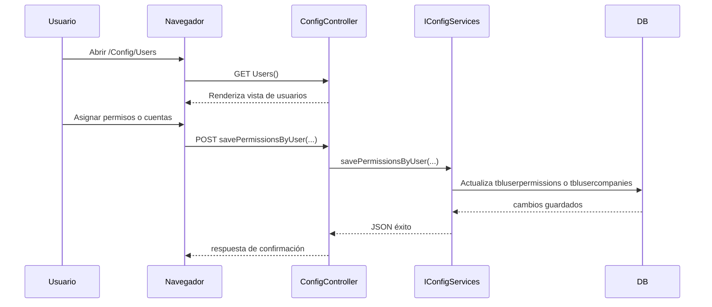

# Documentación de Accountings

## Resumen general

La carpeta `Accountings` contiene un proyecto clásico ASP.NET MVC/WebApi llamado `vtaccountingVtclub`.

Este proyecto está construido como una aplicación Web de contabilidad con las siguientes capas principales:

- `App_Start/`: configuración de arranque de MVC, rutas, filters, bundles y Web API.
- `Controllers/`: controladores MVC que exponen las acciones del ERP.
- `Views/`: vistas Razor para las pantallas del sistema.
- `VTAServices/`: servicios de negocio e interfaces que proveen la lógica de aplicación.
- `VTACore/`: núcleo técnico, acceso a base de datos, repositorios genéricos, utilidades y logging.
- `VTACore/Database/`: entidad principal `VTClubconnector` y clases de tablas generadas.
- `Content/` y `Scripts/`: recursos front-end de CSS, JS y librerías cliente.


## Estructura de carpetas principales

```text
Accountings/vtaccountingVtclub/
├── App_Start/
│   ├── BundleConfig.cs
│   ├── FilterConfig.cs
│   ├── IoConfigurations.cs
│   ├── RouteConfig.cs
│   └── WebApiConfig.cs
├── Controllers/
│   ├── AccountController.cs
│   ├── BankreconciliationController.cs
│   ├── ComplementController.cs
│   ├── ConfigController.cs
│   ├── ErrorsController.cs
│   ├── HomeController.cs
│   ├── budgetController.cs
│   ├── formcontrolController.cs
│   ├── incomeController.cs
│   ├── invoiceController.cs
│   ├── reportsController.cs
│   └── utilsappController.cs
├── Views/
│   ├── Account/
│   ├── Errors/
│   ├── Home/
│   ├── Shared/
│   ├── bankreconciliation/
│   ├── budget/
│   ├── common/
│   ├── config/
│   ├── contables/
│   ├── income/
│   ├── invoice/
│   ├── reconciliation/
│   ├── reports/
│   └── users/
├── VTACore/
│   ├── Collections/
│   ├── Cores/
│   ├── Database/
│   │   ├── VTClubconnector.Context.cs
│   │   ├── VTClubconnector.Designer.cs
│   │   ├── VTClubconnector.edmx
│   │   ├── tbl*.cs (múltiples clases de tablas)
│   ├── GenericRepository/
│   ├── Helpers/
│   ├── Logger/
│   ├── Resolves/
│   └── Utils/
├── VTAServices/
│   ├── Services/
│   │   ├── accounts/
│   │   │   ├── IAccountServices.cs
│   │   │   └── implements/AccountServices.cs
│   │   ├── invoices/
│   │   │   ├── IInvoiceServices.cs
│   │   │   └── implements/InvoiceServices.cs
│   │   ├── attachments/
│   │   │   ├── IAttachmentServices.cs
│   │   │   └── implements/AttachmentServices.cs
│   │   ├── comments/
│   │   │   ├── ICommentServices.cs
│   │   │   └── implements/CommentServices.cs
│   │   ├── incomes/
│   │   │   ├── IIncomeServices.cs
│   │   │   └── implements/IncomeServices.cs
│   │   ├── budgets/
│   │   │   ├── IBudgetServices.cs
│   │   │   └── implements/BugetServices.cs
│   │   ├── bankreconciliation/
│   │   │   ├── IBankReconciliationServices.cs
│   │   │   └── implements/BankReconciliationServices.cs
│   │   ├── utilsapp/
│   │   │   ├── IUtilsappServices.cs
│   │   │   └── implements/UtilsappServices.cs
│   │   ├── Logger/
│   │   │   ├── ILogsServices.cs
│   │   │   └── Implementations/LogsServices.cs
│   │   └── users/
│   │       └── UserServices.cs
├── Content/
│   ├── css/
│   ├── datatable/
│   ├── fontawesome/
│   ├── jqueryconfirm/
│   ├── jsgrid-1.5.3/
│   ├── sidebar/
│   ├── themes/
│   ├── treeview/
│   └── vtacss/
├── Scripts/
│   ├── VTAFrameworks/
│   ├── VTAScripts/
│   ├── account/
│   ├── bankstatement/
│   ├── budget/
│   ├── config/
│   ├── income/
│   ├── invoice/
│   ├── report/
│   ├── utils/
│   └── moment/
└── Web.config
```

> Nota: `Accountings/packages/` contiene paquetes NuGet descargados y dependencias locales. No se documentan en detalle aquí.


## Archivos raíz importantes

- `Global.asax` / `Global.asax.cs`: punto de inicio de la aplicación.
- `Web.config`: configuración principal de ASP.NET.
- `App_Start/RouteConfig.cs`: rutas MVC.
- `App_Start/WebApiConfig.cs`: rutas Web API y CORS.
- `App_Start/IoConfigurations.cs`: configuración de IoC / inyección de dependencias.


## Flujo de arranque

1. `MvcApplication.Application_Start()` inicia:
   - `AreaRegistration.RegisterAllAreas()`
   - `GlobalConfiguration.Configure(WebApiConfig.Register)`
   - `FilterConfig.RegisterGlobalFilters(...)`
   - `RouteConfig.RegisterRoutes(...)`
   - `BundleConfig.RegisterBundles(...)`
   - `IoConfigurations.Configure()`
   - `log4net.Config.XmlConfigurator.Configure()`

2. `RouteConfig` define la ruta por defecto:
   - `/{controller}/{action}/{id}`
   - controlador por defecto: `Account`, acción `Login`

3. `WebApiConfig` habilita CORS para todas las peticiones y define una ruta API:
   - `api/{controller}/{id}`


## Diagrama de clases conceptual

```mermaid
classDiagram
    class MvcApplication
    class RouteConfig
    class WebApiConfig
    class IoConfigurations

    class AccountController
    class InvoiceController
    class IncomeController
    class BudgetController
    class BankreconciliationController
    class ConfigController
    class ReportsController
    class UtilsappController
    class HomeController

    class IAccountServices
    class AccountServices
    class IInvoiceServices
    class InvoiceServices
    class IAttachmentServices
    class AttachmentServices
    class ICommentServices
    class CommentServices
    class IIncomeServices
    class IncomeServices
    class IBudgetServices
    class BudgetServices
    class IBankReconciliationServices
    class BankReconciliationServices
    class IUtilsappServices
    class UtilsappServices

    class VTClubconnector
    class tblinvoice
    class tblinvoiceditem
    class tblinvoiceattach
    class tblpayment
    class tblinvoicecomments
    class tblincome
    class tblincomeitem
    class tblincomemovement
    class tblincomeattach
    class tblfondos
    class tblbankstatements
    class tblbankstatementsdet
    class tblcompanies
    class tblcurrencies
    class tblusers
    class tblbankaccount
    class tblbankstatementmethod
    class tbltpv
    class tblaccountsl4
    class tblinvoiceitemstatus
    class tblbugettype

    MvcApplication --> RouteConfig
    MvcApplication --> WebApiConfig
    MvcApplication --> IoConfigurations

    AccountController --> IAccountServices
    InvoiceController --> IInvoiceServices
    InvoiceController --> IAttachmentServices
    InvoiceController --> ICommentServices
    InvoiceController --> IIncomeServices
    IncomeController --> IIncomeServices
    BudgetController --> IBudgetServices
    BankreconciliationController --> IBankReconciliationServices
    ConfigController --> IUtilsappServices
    UtilsappController --> IUtilsappServices
    HomeController --> IAccountServices

    IAccountServices <|-- AccountServices
    IInvoiceServices <|-- InvoiceServices
    IAttachmentServices <|-- AttachmentServices
    ICommentServices <|-- CommentServices
    IIncomeServices <|-- IncomeServices
    IBudgetServices <|-- BudgetServices
    IBankReconciliationServices <|-- BankReconciliationServices
    IUtilsappServices <|-- UtilsappServices

    AccountServices --> VTClubconnector
    InvoiceServices --> VTClubconnector
    AttachmentServices --> VTClubconnector
    IncomeServices --> VTClubconnector
    BankReconciliationServices --> VTClubconnector
    BudgetServices --> VTClubconnector
    UtilsappServices --> VTClubconnector

    InvoiceServices --> tblinvoice
    InvoiceServices --> tblinvoiceditem
    InvoiceServices --> tblinvoiceattach
    InvoiceServices --> tblpayment
    InvoiceServices --> tblinvoicecomments
    IncomeServices --> tblincome
    IncomeServices --> tblincomeitem
    IncomeServices --> tblincomemovement
    IncomeServices --> tblincomeattach
    BudgetServices --> tblfondos
    BankReconciliationServices --> tblbankstatements
    BankReconciliationServices --> tblbankstatementsdet

    tblinvoice ||--o{ tblinvoiceditem : contains
    tblinvoice ||--o{ tblinvoiceattach : has
    tblinvoice ||--o{ tblpayment : payments
    tblinvoice ||--o{ tblinvoicecomments : comments
    tblinvoice }o--|| tblcompanies : company
    tblinvoice }o--|| tblcurrencies : currency
    tblinvoice }o--|| tblusers : createdBy
    tblinvoice }o--|| tblusers : updatedBy

    tblincome ||--o{ tblincomeitem : contains
    tblincome ||--o{ tblincomeattach : has
    tblincome ||--o{ tblincomemovement : movements
    tblincome }o--|| tblcompanies : company
    tblincome }o--|| tblcurrencies : currency
    tblincome }o--|| tblusers : createdBy
    tblincome }o--|| tblusers : updatedBy

    tblincomemovement }o--|| tblbankaccount : bankAccount
    tblincomemovement }o--|| tblbankstatementmethod : statementMethod
    tblincomemovement }o--|| tbltpv : tpv

    tblfondos }o--|| tblbankaccount : paymentAccount
    tblfondos }o--|| tblbankaccount : financialAccount
    tblfondos }o--|| tblbugettype : budgetType

    tblbankstatements ||--o{ tblbankstatementsdet : details
    tblbankstatements }o--|| tblbankaccount : bankAccount
    tblbankstatements }o--|| tblbankstatementmethod : statementMethod
    tblbankstatements }o--|| tblcompanies : company
    tblbankstatements }o--|| tbltpv : tpv
```

> Este diagrama es conceptual y refleja la relación principal entre controladores, servicios e infraestructura de datos.


## Principales casos de uso del proyecto

### 1. Autenticación y sesión
- Login de usuario.
- Verificación de credenciales con `AccountServices`.
- Obtención de datos de sesión y permisos.
- Cierre de sesión con limpieza de `Session` y `FormsAuthentication`.

### 2. Gestión de facturas
- Crear factura (`SendInvoice`).
- Actualizar factura (`UpdateInvoice`).
- Eliminar factura (`DeleteInvoice`).
- Buscar facturas con filtros de número, empresa, monto y fechas (`GetInvoice`).
- Consultar factura por ID (`GetInvoicebyId` si existe en servicio).

### 3. Gestión de partidas de factura
- Crear partida de factura (`SendInvoiceItem`).
- Actualizar partida de factura (`SendInvoiceItemUpdate`).
- Eliminar partida de factura (`SendInvoiceItemDelete`).
- Consultar partidas por factura (`GetInvoiceitemsbyId`).

### 4. Pagos de factura
- Registrar pago de factura (`SendInvoicePayment`).
- Consultar pagos de factura por ID (`InvoicePaymentsGetbyId`).

### 5. Adjuntos y documentos
- Subir y guardar adjuntos de factura y de ingreso.
- Consultar adjuntos existentes.
- Eliminar adjuntos asociados.

### 6. Gestión de ingresos
- Buscar ingresos con filtros de monto y fechas.
- Crear, actualizar y eliminar ingresos.
- Gestionar partidas de ingreso y movimientos de pago.

### 7. Presupuestos y disponibilidad financiera
- Consulta de presupuesto por hotel, fecha y forma de pago.
- Estado financiero disponible.
- Creación, actualización y eliminación de fondos.
- Cálculo de presupuesto final por fecha.
- Gestión de limitadores de presupuesto.

### 8. Conciliación bancaria
- Buscar extractos bancarios y conciliaciones.
- Guardar estados de banco y conciliaciones.
- Eliminar estados y partidas de conciliación.
- Generar reportes de conciliación en Excel.
- Cargar archivos de conciliación y procesar datos.

### 9. Configuración y utilidades
- Configuración de parámetros de la aplicación.
- Métodos auxiliares de fechas y calendario.
- Rutas de descarga de anexos y archivos.

### 10. Reportes
- Generación y consulta de reportes administrativos.
- Exposición de datos para paneles e indicadores.


## Resumen de controladores y rutas

La aplicación usa rutas MVC convencionales definidas en `App_Start/RouteConfig.cs`:
- `/{controller}/{action}/{id}`
- controlador por defecto: `Account`
- acción por defecto: `Login`
- ruta adicional para descargas: `utilsapp/downloadbinarydocumentBills/{id}/{type}`

### Controladores principales

- `AccountController`
  - `GET /Account/Login`: vista de login.
  - `POST /Account/Login`: envía credenciales y autentica.
  - `GET /Account/LogOff`: cierra sesión.
  - `GET /Account/NoAccess`: vista de acceso denegado.
  - `GET /Account/AccountIdentify`: retorna datos de sesión en JSON.
  - `GET /Account/isBasic`: consulta si el usuario es básico.

- `InvoiceController`
  - `GET /Invoice/invoiceapp`: vista principal de facturas.
  - `GET /Invoice/invoicesearch`: vista de búsqueda de facturas.
  - `POST /Invoice/SendInvoice`: crea factura.
  - `POST /Invoice/UpdateInvoice`: actualiza factura.
  - `POST /Invoice/DeleteInvoice`: elimina factura.
  - `POST /Invoice/SendInvoiceItem`: crea partida de factura.
  - `POST /Invoice/SendInvoiceItemUpdate`: actualiza partida.
  - `POST /Invoice/SendInvoiceItemDelete`: elimina partida.
  - `GET /Invoice/GetInvoiceitemsbyId`: consulta partidas por factura.
  - `POST /Invoice/SendInvoicePayment`: registra pago de factura.
  - `GET /Invoice/InvoicePaymentsGetbyId`: consulta pagos.

- `HomeController`
  - vista de panel principal y páginas generales.

- `BudgetController`
  - vistas y acciones de presupuesto.

- `BankreconciliationController`
  - vistas y acciones de conciliación bancaria.

- `ConfigController`
  - vistas y acciones de configuración de la aplicación.

- `UtilsappController`
  - `GET /utilsapp/downloadbinarydocumentBills/{id}/{type}`: descarga de documentos.

- `ReportsController`
  - vistas y acciones de generación de reportes.

### Rutas de API Web

`App_Start/WebApiConfig.cs` habilita la API REST con la ruta:
- `api/{controller}/{id}`

Esto permite exponer controladores Web API si se agregan en el proyecto, además de las rutas MVC normales.


## Diagrama de base de datos

El modelo de datos central de `vtaccountingVtclub` está generado con Entity Framework clásico y se apoya en varias tablas `tbl*` con relaciones de uno a muchos. A continuación se incluye un esquema basado en las entidades de facturas, ingresos, presupuestos y conciliación bancaria.

```mermaid
erDiagram
    TBLINVOICE {
        long idinvoice PK
        int idcompany FK
        int idcurrency FK
        datetime invoicedate
        int invoicenumber
        int invoicecreatedby
        datetime invoicecreateon
        int invoiceupdatedby
        datetime invoiceupdateon
    }
    TBLINVOICEDITEM {
        long idinvoiceitem PK
        long idinvoice FK
        int iduser FK
        int idaccountl4 FK
        int idinvoiceitemstatus FK
        int idbudgettype FK
        int idsupplier FK
        decimal itemsubtotal
        string itemdescription
        bool ditemistax
        decimal itemtax
        bool itemsinglepayment
    }
    TBLINVOICEATTACH {
        int idinvoiceattach PK
        long idinvoice FK
        int idattach FK
        string invoiceattachname
        string invoiceattachdirectory
        string invoiceattachcontenttype
        bool invoiceattachactive
    }
    TBLINCOME {
        long idincome PK
        int idcompany FK
        int idcurrency FK
        datetime incomeapplicationdate
        int incomenumber
        int incomecreatedby
        datetime incomecreactiondate
        int incomeupdatedby
        datetime incometupdateon
    }
    TBLINCOMEITEM {
        long idincomeitem PK
        long idincome FK
        int idAccountl4 FK
        int idincomeitemstatus FK
        int iduser FK
        datetime incomeitemdate
        decimal incomeitemsubtotal
        string incomedescription
    }
    TBLINCOMEMOVEMENT {
        long idincomeMovement PK
        long idincome FK
        int idbaccount FK
        int idbankaccnttype FK
        int idtpv FK
        datetime incomemovapplicationdate
        decimal incomemovchargedamount
    }
    TBLINCOMEATTACH {
        int idincomeattach PK
        long idincome FK
        int idattach FK
        string incomeattachname
        bool incomeattachactive
    }
    TBLFONDOS {
        int idFondos PK
        int idPaymentMethod FK
        int idFinancialMethod FK
        datetime fondofechaEntrega
        datetime fondoFechaInicio
        datetime fondoFechaFin
        decimal fondoMonto
        long? fondoInvoice FK
    }
    TBLBANKSTATEMENTS {
        long idBankStatements PK
        int idBAccount FK
        int idTPV FK
        int idCompany FK
        int? idBankStatementMethod FK
        datetime bankstatementAplicationDate
        decimal bankstatementAppliedAmmount
    }
    TBLBANKSTATEMENTSDET {
        long idBankStatementsDet PK
        long? idBankStatements FK
        int idTPV FK
        datetime bankStatementsDetSaleDate
        decimal bankStatementsDetSaleAmnt
    }

    TBLINVOICE ||--o{ TBLINVOICEDITEM : contains
    TBLINVOICE ||--o{ TBLINVOICEATTACH : has
    TBLINVOICE ||--o{ TBLPAYMENT : payments
    TBLINVOICE ||--o{ TBLINVOICECOMMENTS : comments
    TBLINVOICE }o--|| TBLCOMPANIES : company
    TBLINVOICE }o--|| TBLCURRENCIES : currency
    TBLINVOICE }o--|| TBLUSERS : createdBy
    TBLINVOICE }o--|| TBLUSERS : updatedBy

    TBLINCOME ||--o{ TBLINCOMEITEM : contains
    TBLINCOME ||--o{ TBLINCOMEATTACH : has
    TBLINCOME ||--o{ TBLINCOMEMOVEMENT : movements
    TBLINCOME }o--|| TBLCOMPANIES : company
    TBLINCOME }o--|| TBLCURRENCIES : currency
    TBLINCOME }o--|| TBLUSERS : createdBy
    TBLINCOME }o--|| TBLUSERS : updatedBy

    TBLINCOMEMOVEMENT }o--|| TBLBANKACCOUNT : bankAccount
    TBLINCOMEMOVEMENT }o--|| TBLBANKPRODTTYPE : bankProductType
    TBLINCOMEMOVEMENT }o--|| TBLTPV : tpv

    TBLFONDOS }o--|| TBLBANKACCOUNT : paymentAccount
    TBLFONDOS }o--|| TBLBANKACCOUNT : financialAccount
    TBLFONDOS }o--|| TBLFINANCETYPE : financeType
    TBLFONDOS ||--o{ TBLBANKSTAT2FONDO : reconciliationLinks

    TBLBANKSTATEMENTS ||--o{ TBLBANKSTATEMENTSDET : details
    TBLBANKSTATEMENTS }o--|| TBLBANKACCOUNT : bankAccount
    TBLBANKSTATEMENTS }o--|| TBLBANKSTATEMENTMETHOD : statementMethod
    TBLBANKSTATEMENTS }o--|| TBLCOMPANIES : company
    TBLBANKSTATEMENTS }o--|| TBLTPV : tpv
```


## Diagramas de secuencia

### 1. Login / sesión



### 2. Facturación (`invoiceapp` / `invoicesearch`)



### 3. Ingresos (`incomeaddvw` / `incomeeditvw`)



### 4. Presupuestos (`BudgetController`)



### 5. Conciliación bancaria (`BankreconciliationController`)



### 6. Configuración de usuarios (`ConfigController`)



## Notas adicionales

- La carpeta `VTACore/Database` contiene una colección extensa de clases `tbl*` que reflejan el modelo de datos de la base de datos.
- La carpeta `VTAServices/Services` está organizada por submódulos de negocio: cuentas, facturas, adjuntos, comentarios, ingresos, presupuestos, conciliación y utilidades.
- `IoConfigurations.cs` sugiere que la aplicación utiliza inyección de dependencias para resolver servicios a controladores.
- `WebApiConfig.cs` habilita CORS amplio, lo que permite llamadas AJAX desde cualquier origen en la API.

---

*Documento generado para describir la carpeta `Accountings` y el proyecto `vtaccountingVtclub` en `.Doc/Contexto Actual/Accountings.md`.*
