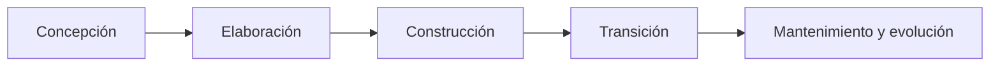
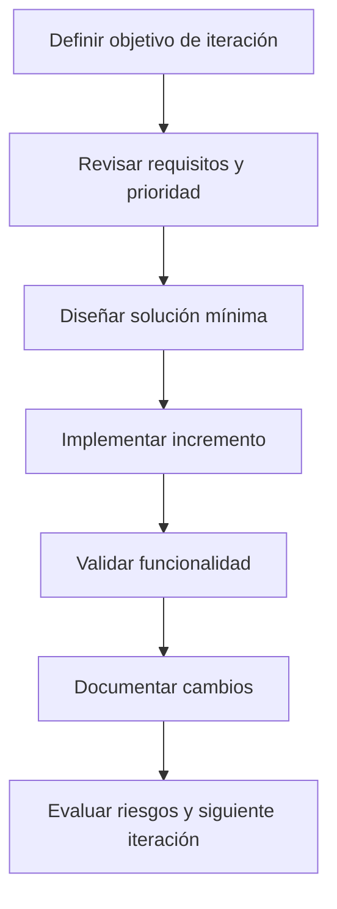
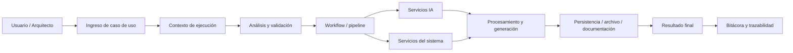

# Documento RUP de flujo de trabajo

## 1. Objetivo

Este documento describe el flujo de trabajo recomendado para desarrollar Fenix Engine bajo una metodología RUP. El foco está en la ejecución gradual del proyecto por fases, iteraciones y entregables, evitando la creación de un sistema completo sin validar su base técnica y funcional.

---

## 2. Visión del flujo RUP

RUP se apoya en cuatro ideas principales:

- iteración continua;
- arquitectura evolutiva;
- trazabilidad de requisitos;
- entrega de valor incremental.

Para este proyecto, el flujo debe permitir que cada ciclo resuelva parte del problema del sistema, ya sea:

- servicio de IA;
- flujo de ejecución;
- documentación;
- persistencia;
- estructura de proyecto;
- validación y automatización.

---

## 3. Fases del proceso

### Fase 1: Concepción
- validar objetivo del sistema;
- definir alcance inicial;
- identificar actores, casos de uso y riesgos;
- establecer hipótesis de negocio y viabilidad técnica.

### Fase 2: Elaboración
- definir arquitectura base;
- priorizar módulos funcionales;
- analizar conexiones IA, persistencia y servicio compartido;
- preparar el backlog de trabajo.

### Fase 3: Construcción
- implementar incrementos funcionales;
- probar la integración entre módulos;
- validar cada flujo con casos de uso reales;
- ajustar la arquitectura según los resultados.

### Fase 4: Transición
- validar despliegue y operación;
- preparar documentación y entrega;
- corregir defectos críticos;
- definir roadmap de evolución.

---

## 4. Flujo de iteración recomendado

Cada iteración debe responder a una pregunta clara:

- ¿qué valor funcional se entrega?
- ¿qué riesgo se redujo?
- ¿qué parte de la arquitectura se reforzó?
- ¿qué se debe ajustar en la siguiente iteración?

---

## 5. Flujo de trabajo del sistema

Este flujo refleja la lógica actual del proyecto: se parte de una solicitud o caso de uso, se crea un contexto, se ejecuta una serie de pasos y se generan resultados con trazabilidad documental.

---

## 6. Criterios de una iteración exitosa

Una iteración es exitosa cuando:

- se cumple el objetivo funcional asignado;
- la solución queda documentada;
- se validan cambios relevantes;
- hay evidencia de control de riesgos;
- el producto avanza sin romper lo ya construido.

---

## 7. Trabajo por módulos

La organización del proyecto sugiere separar la ejecución por módulos funcionales, por ejemplo:

- motor de flujo;
- modelos y agentes IA;
- servicios de archivos y terminal;
- integración con base de datos;
- UI y experiencia del usuario.

Esto ayuda a planificar iteraciones por capacidad, no por “ código suelto”.

---

## 8. Matriz de prioridad sugerida

### Prioridad alta
- arranque del sistema;
- contexto y pipeline;
- servicios compartidos;
- integración con IA;
- persistencia básica.

### Prioridad media
- documentación automática;
- validación de proyecto generado;
- mejora del manejo de errores;
- más proveedores o extensiones.

### Prioridad baja
- optimizaciones avanzadas;
- mejoras visuales o de UX;
- nuevas capacidades no críticas del sistema.

---

## 9. Guía de trabajo del equipo

### Antes de iniciar una iteración
- definir objetivo claro;
- validar alcance y prioridad;
- asegurar que hay requisitos y contexto.

### Durante la iteración
- implementar el incremento mínimo viable;
- documentar decisiones clave;
- validar con pruebas y verificación funcional.

### Al final de la iteración
- revisar resultados;
- evaluar riesgos y ajustes;
- preparar el siguiente paso.

---

## 10. Recomendación final

El flujo más saludable para este proyecto es trabajar por iteraciones pequeñas pero con propósito claro. La idea no es hacer un “gran sistema completo” de una sola vez, sino construirlo de forma controlada: primero la base, luego la IA, luego la persistencia, luego la automatización real y la documentación final.

Este enfoque permite mantener la arquitectura estable, asegurar trazabilidad y facilitar una evolución sostenida del producto.
