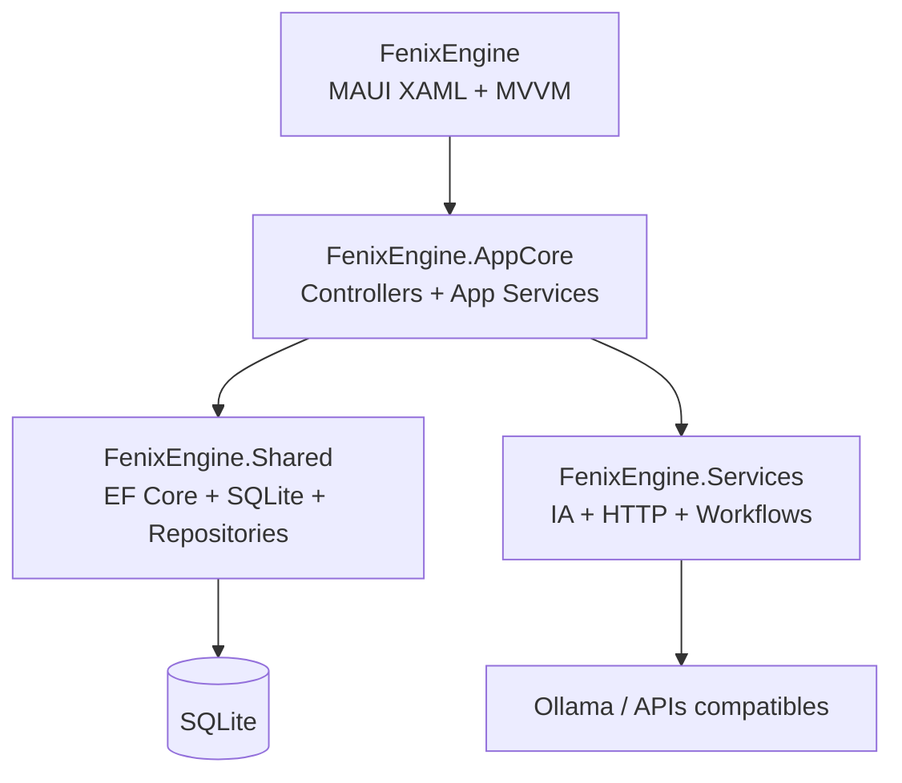

# Documento RUP - FenixEngine

## 1. Control del documento

| Campo | Valor |
|---|---|
| Proyecto | FenixEngine |
| Tipo de documento | Documento de visión y arquitectura basado en RUP |
| Estado | Contexto actual del prototipo funcional |
| Fecha | 2026-09-22 |
| Plataforma | .NET MAUI |
| Persistencia | SQLite con Entity Framework Core |
| Audiencia | Arquitectura, análisis, desarrollo y validación |

## 2. Resumen ejecutivo

FenixEngine es una herramienta de apoyo al desarrollo de software que transforma especificaciones, prompts y decisiones arquitectónicas en actividades ejecutables y artefactos técnicos. La aplicación proporciona una interfaz MAUI para administrar proyectos, actividades, tareas y configuraciones de agentes de IA.

El sistema combina agentes locales, principalmente Ollama, con servicios cloud compatibles con APIs de conversación. Su arquitectura separa la presentación, la lógica de aplicación, las integraciones técnicas y los componentes compartidos.

El producto se encuentra en una fase de prototipo funcional. La estructura principal, la persistencia inicial y los flujos de consulta están implementados, mientras que las operaciones CRUD, la seguridad de producción y la validación automatizada requieren trabajo adicional.

## 3. RUP: Incepción

### 3.1 Problema

Los equipos necesitan convertir decisiones de arquitectura y especificaciones de diseño en estructuras de proyectos, documentos, tareas y acciones repetibles. Este trabajo suele estar disperso entre herramientas de chat, editores, terminales y documentos independientes.

### 3.2 Oportunidad

Centralizar la interacción con agentes de IA y conservar el contexto de desarrollo permite:

- reducir tareas manuales;
- mantener trazabilidad;
- reutilizar flujos de generación;
- organizar actividades por proyecto;
- producir documentación técnica con una estructura conocida.

### 3.3 Visión del producto

FenixEngine permitirá iniciar o mantener proyectos de software a partir de especificaciones humanas, ejecutar flujos asistidos por IA, generar artefactos técnicos y conservar el historial de decisiones y actividades en una aplicación multiplataforma.

### 3.4 Actores

| Actor | Descripción |
|---|---|
| Arquitecto de software | Define stack, arquitectura, restricciones y objetivos del proyecto. |
| Analista o desarrollador | Ejecuta prompts, revisa resultados y gestiona tareas. |
| Usuario autenticado | Consulta proyectos, actividades, tareas y configuración. |
| Agente local | Servicio Ollama u otro endpoint local compatible. |
| Proveedor cloud | Servicio de IA externo configurado por el usuario. |
| Sistema de archivos | Destino de documentos y estructuras generadas. |

### 3.5 Casos de uso principales

- Iniciar sesión.
- Consultar dashboard de proyectos.
- Crear un nuevo proyecto.
- Consultar actividades.
- Filtrar actividades por proyecto y texto.
- Consultar tareas agrupadas por proyecto.
- Configurar proveedores cloud.
- Configurar agentes locales.
- Ejecutar un prompt.
- Generar un documento RUP.
- Generar una estructura de proyecto.
- Registrar resultados y actividad.

### 3.6 Alcance de la versión actual

La versión actual cubre el inicio de sesión de pruebas, la navegación principal, la consulta de datos SQLite, la configuración inicial y la base de servicios de generación. La creación visual de proyectos, la actualización de configuración y la administración completa de actividades todavía forman parte del alcance pendiente.

## 4. RUP: Elaboración

### 4.1 Arquitectura candidata

La arquitectura se divide en los siguientes bloques:

### 4.2 Componentes principales

#### Presentación

- Páginas MAUI XAML en `FenixEngine/Src/Components/pages`.
- ViewModels en `FenixEngine/Src/ModelView`.
- Binding mediante `BindingContext` y comandos.
- `CollectionView` para proyectos, actividades y tareas.

#### Aplicación

- `ProjectPortfolioController` coordina consultas para el portfolio.
- `WorkflowController` coordina ejecución de prompts, RUP y arquitectura.
- `AuthenticationService` valida usuarios contra SQLite.
- `ProjectDataService` transforma entidades en DTOs de presentación.
- `SettingsDataService` transforma la configuración persistida para la UI.

#### Datos

- `ServiceDbContext` define el modelo EF Core.
- SQLite almacena usuarios, proyectos, actividades, tareas, tokens y agentes.
- Repositorios encapsulan consultas y operaciones de persistencia.
- `DatabaseInitializer` crea o actualiza la base durante el arranque.

#### Integraciones

- Cliente HTTP para endpoints de IA.
- Ollama mediante endpoint compatible con OpenAI.
- Servicios de generación de prompts, documentos RUP y arquitectura.
- Servicios de archivos, carpetas, terminal y logging.

### 4.3 Modelo de dominio actual

#### Usuario

`UserArchitect` representa al usuario de la aplicación y contiene identidad, correo y hash de contraseña para el entorno de pruebas.

#### Proyecto

`GeneralProyects` representa un proyecto gestionado en FenixEngine. Se relaciona con `ProyectType` y puede tener actividades y tareas.

#### Actividad

`UserActivity` registra la participación o actividad de un usuario en un proyecto.

#### Tarea

`ProjectTask` representa una actividad ejecutable o completada con estado, prioridad, fechas y proyecto asociado.

#### Configuración

- `AiApiToken` representa proveedores cloud y sus tokens.
- `LocalAgentConfiguration` representa endpoints locales como Ollama.

### 4.4 Requisitos funcionales

| ID | Requisito | Estado |
|---|---|---|
| RF-01 | El sistema debe permitir iniciar sesión | Implementado para pruebas |
| RF-02 | El sistema debe mostrar proyectos del usuario | Implementado |
| RF-03 | El sistema debe mostrar actividades | Implementado |
| RF-04 | El sistema debe filtrar actividades | Implementado |
| RF-05 | El sistema debe mostrar tareas agrupadas por proyecto | Implementado |
| RF-06 | El sistema debe mostrar configuración cloud y local | Implementado en lectura |
| RF-07 | El sistema debe guardar cambios de configuración | Pendiente |
| RF-08 | El sistema debe crear proyectos desde la UI | Pendiente |
| RF-09 | El sistema debe ejecutar prompts | Implementado en servicio |
| RF-10 | El sistema debe generar documentos RUP | Implementado en servicio |
| RF-11 | El sistema debe generar estructuras de proyecto | Implementado en servicio |
| RF-12 | El sistema debe conservar historial de actividades | Parcial |

### 4.5 Requisitos no funcionales

- **RNF-01:** La aplicación debe ejecutarse en las plataformas soportadas por .NET MAUI.
- **RNF-02:** La UI no debe acceder directamente a DbContext.
- **RNF-03:** La lógica de negocio debe permanecer en AppCore.
- **RNF-04:** Las integraciones externas deben permanecer en Services.
- **RNF-05:** La persistencia debe estar encapsulada en Shared y repositorios.
- **RNF-06:** Los controles deben mantener contraste suficiente.
- **RNF-07:** La aplicación debe soportar funcionamiento local sin depender siempre de una API remota.
- **RNF-08:** Los tokens de proveedores no deben almacenarse sin protección en producción.
- **RNF-09:** El sistema debe poder actualizar el esquema de datos mediante migraciones.

## 5. RUP: Construcción

### 5.1 Iteración actual

La iteración actual se concentra en estabilizar la base funcional y separar correctamente la presentación mediante MVVM.

Entregables realizados:

- solución MAUI compilable;
- capas Shared, Services y AppCore;
- páginas principales;
- ViewModels;
- SQLite y entidades EF Core;
- repositorios concretos;
- inicialización de base para pruebas;
- autenticación local de pruebas;
- consultas de proyectos, actividades y tareas;
- servicios de workflow.

### 5.2 Flujo de inicio

1. `MauiProgram` construye el contenedor DI.
2. Se registran Shared, Services, AppCore y ViewModels.
3. Se inicializa SQLite.
4. En `DEBUG`, se recrea la base con el modelo y las semillas actuales.
5. `App` inicia una `NavigationPage` con `LoginPage`.
6. El usuario se autentica.
7. La aplicación navega a `MainPage`.

### 5.3 Flujo de consulta del dashboard

1. `MainPage` resuelve `MainPageViewModel`.
2. El ViewModel solicita datos al `ProjectPortfolioController`.
3. AppCore utiliza `ProjectDataService`.
4. El servicio consulta `IProjectRepository`.
5. EF Core ejecuta la consulta sobre SQLite.
6. Los DTOs se exponen mediante el binding `Projects`.

### 5.4 Flujo de ejecución de IA

1. El usuario proporciona una acción o prompt.
2. `WorkflowController` establece el estado `Prompting`.
3. Se selecciona el flujo de prompt, RUP o arquitectura.
4. Services ejecuta el cliente HTTP o las operaciones de archivos.
5. El workflow pasa por `Generating` y `Validating`.
6. El resultado finaliza en `Completed` o `Error`.

## 6. RUP: Transición

### 6.1 Actividades de transición pendientes

- Crear migraciones EF Core formales.
- Verificar la ejecución en MacCatalyst y Android con datos reales.
- Sustituir la recreación automática de DEBUG por una estrategia controlada cuando comiencen las pruebas persistentes.
- Actualizar la dependencia SQLite vulnerable.
- Crear pruebas automatizadas.
- Definir la distribución y configuración de endpoints de IA.
- Proteger tokens y credenciales mediante almacenamiento seguro.

### 6.2 Criterios de aceptación de la próxima versión

- El usuario puede iniciar sesión correctamente.
- El dashboard muestra únicamente proyectos accesibles al usuario.
- La selección de proyecto filtra actividades.
- Las tareas aparecen agrupadas y muestran su estado correcto.
- Cambiar una configuración se conserva después de reiniciar.
- Crear un proyecto produce una entidad persistida.
- Un prompt produce una respuesta o un error controlado.
- Un workflow fallido deja registro y estado `Error`.
- La aplicación inicia sin excepciones de esquema SQLite.

## 7. Riesgos

| Riesgo | Impacto | Mitigación |
|---|---|---|
| Esquema SQLite desactualizado | Alto | Migraciones EF Core y versionado de esquema. |
| Dependencia SQLite vulnerable | Alto | Actualizar paquetes y revisar compatibilidad MAUI. |
| Tokens almacenados sin protección | Alto | Usar `SecureStorage` y no persistir secretos en texto plano. |
| Fallos de agentes locales | Medio | Timeouts, mensajes de error y endpoint configurable. |
| Bloqueo de UI por llamadas síncronas | Medio | Migrar controladores a APIs asíncronas. |
| Falta de pruebas automatizadas | Medio | Añadir pruebas para repositorios, AppCore y ViewModels. |
| Diferencias entre plataformas nativas | Medio | Validación en dispositivos y consulta de propiedades renderizadas. |

## 8. Decisiones y restricciones

- Se utiliza MAUI XAML para la UI actual.
- La UI debe depender de AppCore y de ViewModels, no de DbContext.
- Shared contiene persistencia y contratos comunes.
- Services contiene integraciones técnicas y proveedores de IA.
- AppCore coordina casos de uso.
- La base local se utiliza para facilitar operación y pruebas.
- La recreación automática de base está limitada a `DEBUG`.

## 9. Próximos incrementos

1. Implementar CRUD visual de proyectos.
2. Implementar edición persistente de Settings.
3. Añadir CRUD de tareas y actividades.
4. Añadir sesión persistente y logout.
5. Crear migraciones EF Core.
6. Sustituir autenticación de prueba por credenciales seguras.
7. Añadir pruebas automatizadas.
8. Validar UI con MauiDevFlow en un agente conectado.
